# ECA/SAE + ProVerif Model Flow Diagram

This is an extension of [Appendix A from the ECA I-D](https://www.ietf.org/archive/id/draft-ritz-eca-00.html#name-formal-modelling-informativ), providing deeper explanations, variable mappings, and diagrams. 

The baseline model (`eca-pv.baseline.happy-path.model.pv`) focuses on the happy path for a single Attester-Verifier pair, including a Key Compromise Impersonation (KCI) test. It has been executed and proven to satisfy all queries (see proof output in the repo or run `proverif eca-pv.baseline.happy-path.model.pv`).
For unhappy-path models (e.g., forward secrecy, state reveal), see other files in this dir.

## [Key ECA Terminology Mappings](https://www.ietf.org/archive/id/draft-ritz-eca-00.html#name-conventions-and-definitions):
| ProVerif Term | ECA Draft Term | Crypto Function / Composition |
|---------------|----------------|-------------------------------|
| `bf` | Boot Factor (BF) | `Provisioned high-entropy value (≥128 bits random; no derivation)` |
| `ifa` | Instance Factor (IF) | `Secret from IFP (e.g., Pattern C: full artifact content containing BF)` |
| `vf` | Validator Factor (VF) | `SHA-256(VFSeed \|\| IF), where VFSeed is random (32 bytes)` |
| `uuid` | Exchange Identifier (eca_uuid) | `UUIDv4 (generated for uniqueness/replay prevention)` |
| `ihb` | Integrity Hash Beacon (IHB) | `SHA-256(BF \|\| IF)` |
| `encPubKey` | KEM Public Key (kem_pub) | `X25519 public key from private derived via HKDF-SHA256(BF \|\| IF \|\| UUID \|\| "enc_key")` |
| `jp_proof` | Joint Possession Proof | `SHA-256(BF \|\| VF)` |
| `pop_tag` | Proof-of-Possession (PoP) | `HMAC-SHA256(key=HKDF-SHA256(BF \|\| VF \|\| UUID \|\| "mac_key"), msg=SHA-256(IHB \|\| PubKey \|\| Nonce))` |
| `idKey` | Ed25519 Identity Key | `Ed25519 private via HKDF-SHA512(BF \|\| VF \|\| UUID \|\| "identity_key")` |
| `final_eat_payload` | Signed EAT Evidence | `CBOR-encoded claims (IHB, JP, Nonce, PubKey, PoP) signed with COSE_Sign1(Ed25519)` |

**Repository Architecture Note**: This diagram simplifies the SAE repository model for clarity. In practice:
- The Attester publishes to its own controlled outbox
- The Verifier publishes to a neutral repository 
- This decoupling avoids exposing Verifier endpoints to untrusted clients
  
`ATT` <- Attestor's SAE Outbox
`VER` <- Verifier SAE Outbox

```mermaid
sequenceDiagram
    participant ProVerifAtt as ProVerif Attester Events
    participant A as Attester
    participant SAE as SAE Repo Abstract
    participant V as Verifier
    participant ProVerifVer as ProVerif Verifier Events & Queries

    Note over A,V: Phase 1: Attester Generates and Publishes Evidence

    Note over V: VER activates with work-order for given {eca_uuid}/{exchange_id}
    Note over V: VER polls ATT outbox for P1 Evidence
    loop Poll with backoff
        V->>SAE: HEAD ATT/{eca_uuid}/phase1.status
        SAE-->>V: 404 (not ready)
    end

    Note over A: ATT boots with work-order for given {eca_uuid}
    ProVerifAtt->>ProVerifAtt: event AttesterInitiates(bf,ifa,uuid)
    A->>A: Compute encPubKey, IHB, authKey (BF+IF derived)
    A->>A: Generate phase1_mac

    A->>SAE: PUT ATT/{eca_uuid}/phase1_payload (encPubKey, IHB)
    A->>SAE: PUT ATT/{eca_uuid}/phase1_mac
    A->>SAE: PUT ATT/{eca_uuid}/phase1.status (0 bytes)

    Note over A: ATT polls VER outbox for P2 artifacts
    loop Poll with backoff
        A->>SAE: HEAD VER/{eca_uuid}/phase2.status
        SAE-->>A: 404 (not ready)
    end

    Note over V,A: Phase 2: Gate Validation & VF Release

    V->>SAE: HEAD ATT/{eca_uuid}/phase1.status
    SAE-->>V: 200 OK (Content-Length: 0)
    
    V->>SAE: GET ATT/{eca_uuid}/phase1_payload
    V->>SAE: GET ATT/{eca_uuid}/phase1_mac
    
    Note over V: Validation Gates 1-4
    V->>V: Gate 1: MAC Verification
    V->>V: Gate 2: Instance Authorization
    V->>V: Gate 3: IHB Validation
    V->>V: Gate 4: KEM Public Key Match

    ProVerifVer->>ProVerifVer: event VerifierGeneratesNonce(nonce)
    V->>V: Generate VF (Validator Factor), nonce

    V->>V: HPKE encrypt {VF, nonce} with attester_enc_pk
    V->>V: Sign ciphertext with Verifier Ed25519 key
    ProVerifVer->>ProVerifVer: event VFReleased(vf)

    V->>SAE: PUT VER/{eca_uuid}/phase2_ciphertext
    V->>SAE: PUT VER/{eca_uuid}/phase2_verifier_sig
    V->>SAE: PUT VER/{eca_uuid}/phase2.status (0 bytes)

    Note over V: VER polls ATT outbox for final P3 Evidence
    loop Poll with backoff
        V->>SAE: HEAD ATT/{eca_uuid}/phase3.status
        SAE-->>V: 404 (not ready)
    end

    Note over A,V: Phase 3: Joint Possession Proof
        
    A->>SAE: HEAD VER/{eca_uuid}/phase2.status
    SAE-->>A: 200 OK (Content-Length: 0)
    
    A->>SAE: GET VER/{eca_uuid}/phase2_ciphertext
    A->>SAE: GET VER/{eca_uuid}/phase2_verifier_sig

    ProVerifAtt->>ProVerifAtt: event VerifierAuthenticated(verifierIdKey)
    ProVerifAtt->>ProVerifAtt: event VerifierKeyMatch(derivePubKey(verifierIdKey),verifierIdKey)

    ProVerifAtt->>ProVerifAtt: event AttesterAuthenticatesVerifier(verifierPubKey)
    A->>A: Verify Verifier signature, HPKE decrypt
    
    ProVerifAtt->>ProVerifAtt: event AttesterUsesNonce(nonce)
    A->>A: Extract VF, nonce
    
    A->>A: Derive Ed25519 idKey (BF+VF derived)
    A->>A: Compute JP Proof (BF+VF binding)
    A->>A: Compute PoP tag (HMAC with hmacKey)
    A->>A: Create signed EAT with claims

    ProVerifAtt->>ProVerifAtt: event AttesterPresentsKey(pubKey)

    Note over A: NOTE: Post-attestion flow out of scope

    A->>SAE: PUT ATT/{eca_uuid}/phase3_final_eat
    A->>SAE: PUT ATT/{eca_uuid}/phase3_final_sig
    A->>SAE: PUT ATT/{eca_uuid}/phase3_pubKey
    A->>SAE: PUT ATT/{eca_uuid}/phase3.status (0 bytes)
        
    V->>SAE: HEAD ATT/{eca_uuid}/phase3.status
    SAE-->>V: 200 OK (Content-Length: 0)
    
    V->>SAE: GET ATT/{eca_uuid}/phase3_final_eat
    V->>SAE: GET ATT/{eca_uuid}/phase3_final_sig
    V->>SAE: GET ATT/{eca_uuid}/phase3_pubKey
    
    Note over V: Final Gates 5-11
    V->>V: Gate 5: Evidence Time Window
    V->>V: Gate 6: EAT Schema Compliance
    ProVerifVer->>ProVerifVer: event VerifierValidatesWithKey(final_pubKey)
    V->>V: Gate 7: EAT Signature
    V->>V: Gate 8: Nonce Match
    V->>V: Gate 9: JP Validation
    V->>V: Gate 10: PoP Validation
    ProVerifVer->>ProVerifVer: event VerifierAccepts(bf,ifa,uuid)
    V->>V: Gate 11: Identity Uniqueness

    Note over A,V: AR transmission mechanism out of scope
    V->>V: Generate Attestation Result (AR)
    V->>A: Deliver AR (optional) 
```



## ProVerif Events to ECA Protocol Mapping:

| ProVerif Event | ECA Protocol Meaning | Phase | Validation Gate |
|----------------|---------------------|-------|-----------------|
| `AttesterInitiates(bf,ifa,uuid)` | Attester starts ceremony with BF+IF proof | 1 | Gates 1-4 |
| `VerifierGeneratesNonce(nonce)` | Verifier creates freshness token | 2 | Gate 8 |
| `VFReleased(vf)` | Validator Factor generated and bound to IF | 2 | - |
| `VerifierAuthenticated(verifierIdKey)` | Verifier identity confirmed | 2 | - |
| `VerifierKeyMatch(pk,vk)` | Verifier key consistency check | 2 | - |
| `AttesterAuthenticatesVerifier(pk)` | Attester verifies Verifier signature | 2 | - |
| `AttesterUsesNonce(nonce)` | Attester incorporates nonce in EAT | 3 | Gate 8 |
| `AttesterPresentsKey(pk)` | Attester presents BF+VF derived identity | 3 | Gates 7,9 |
| `VerifierValidatesWithKey(pk)` | Verifier confirms key binding | 3 | Gate 9 |
| `VerifierAccepts(bf,ifa,uuid)` | Ceremony completes successfully | 3 | Gates 5-11 |

## Threat Model Context

This baseline happy-path model assumes:
- **Network Attacker**: Dolev-Yao adversary controlling communications
- **Public Boot Factor**: BF is known to the attacker from the start
- **Honest Participants**: Attester and Verifier follow the protocol

The model successfully proves security properties hold against this adversary. For advanced threat models (State Reveal, Key Compromise), see the separate ProVerif models referenced in [Appendix A.2](https://www.ietf.org/archive/id/draft-ritz-eca-00.html#name-boundary-analysis-advanced-).

| Security Property | Corresponding Events | Result |
|-------------------|---------------------|---------|
| **Authentication** | `AttesterInitiates` → `VerifierAccepts` | ✅ True |
| **Freshness** | `VerifierGeneratesNonce` → `AttesterUsesNonce` | ✅ True |
| **Key Binding** | `AttesterPresentsKey` → `VerifierValidatesWithKey` | ✅ True |
| **Confidentiality** | `VFReleased` without attacker(vf) | ✅ True |

## Verbose output from a succesful (happy-path) exchange 

[The prototype for ECA/SAE is available from it's dedicated repository](https://github.com/eca-sae/prototype-eca-sae)

```bash
[RUN 1] Watching logs and waiting for result file...
attester-e8537b23  | [ATT-DIAG] My Hostname: 8f74e95a5f81, IP: 172.29.250.3
attester-e8537b23  | [ATT-DIAG] Configured to poll Verifier at: https://mock-s3-sae-endpoint/zerosign-bucket/e8537b23-5261-4269-b998-1fc0a49187dc/
attester-e8537b23  | ---
attester-e8537b23  | [ATT] Web server started with PID 13.
attester-e8537b23  | [ATT] 0.00s - ATTESTER START
verifier-e8537b23  | [VER-DIAG] My Hostname: 5ee5314a6c4c, IP: 172.29.250.4
verifier-e8537b23  | [VER-DIAG] Configured to poll Attester at: https://attester-e8537b23:8443/e8537b23-5261-4269-b998-1fc0a49187dc/
verifier-e8537b23  | ---
attester-e8537b23  | [ATT] 0.00s - PHASE 1: Authenticated Channel Setup
attester-e8537b23  | [ATT] 0.01s - PUBLISHED: /root/.wellknown/e8537b23-5261-4269-b998-1fc0a49187dc/phase1_payload.cbor
attester-e8537b23  | [ATT] 0.01s - PUBLISHED: /root/.wellknown/e8537b23-5261-4269-b998-1fc0a49187dc/phase1_mac.b64url
attester-e8537b23  | [ATT] 0.01s - PUBLISHED: /root/.wellknown/e8537b23-5261-4269-b998-1fc0a49187dc/initial.status
attester-e8537b23  | [ATT] 0.01s - PHASE 2: Waiting for Verifier Response
attester-e8537b23  | [ATT] 0.01s - POLLING for: https://mock-s3-sae-endpoint/zerosign-bucket/e8537b23-5261-4269-b998-1fc0a49187dc/vf.status (timeout: 20s)
attester-e8537b23  | [tools] https static on :8443 serving /root/.wellknown (self-signed)
attester-e8537b23  | [ATT] 0.05s - Polling https://mock-s3-sae-endpoint/zerosign-bucket/e8537b23-5261-4269-b998-1fc0a49187dc/vf.status: Received status 404, will retry.
verifier-e8537b23  | [VER] 0.00s - VERIFIER START
verifier-e8537b23  | [VER] 0.00s - POLLING for: https://attester-e8537b23:8443/e8537b23-5261-4269-b998-1fc0a49187dc/initial.status (timeout: 60s)
attester-e8537b23  | 172.29.250.4 - - [30/Sep/2025 02:05:43] "HEAD /e8537b23-5261-4269-b998-1fc0a49187dc/initial.status HTTP/1.1" 200 -
verifier-e8537b23  | [VER] 0.04s - FOUND: https://attester-e8537b23:8443/e8537b23-5261-4269-b998-1fc0a49187dc/initial.status
attester-e8537b23  | 172.29.250.4 - - [30/Sep/2025 02:05:43] "GET /e8537b23-5261-4269-b998-1fc0a49187dc/phase1_payload.cbor HTTP/1.1" 200 -
attester-e8537b23  | 172.29.250.4 - - [30/Sep/2025 02:05:43] "GET /e8537b23-5261-4269-b998-1fc0a49187dc/phase1_mac.b64url HTTP/1.1" 200 -
verifier-e8537b23  | [VER] 0.10s - GATE 1: MAC verification
verifier-e8537b23  | [VER] 0.10s - GATE 2: Instance authorization check
verifier-e8537b23  | [VER] 0.10s - GATE 3: IHB validation
verifier-e8537b23  | [VER] 0.10s - GATE 4: KEM public key match
verifier-e8537b23  | [VER] 0.11s - PHASE 2: Generating Validator Factor
verifier-e8537b23  | [VER] 0.11s - PUBLISHED: /S3/zerosign-bucket/e8537b23-5261-4269-b998-1fc0a49187dc/verifier_proof.cose
verifier-e8537b23  | [VER] 0.11s - PUBLISHED: /S3/zerosign-bucket/e8537b23-5261-4269-b998-1fc0a49187dc/vf.status
verifier-e8537b23  | [VER] 0.11s - POLLING for: https://attester-e8537b23:8443/e8537b23-5261-4269-b998-1fc0a49187dc/evidence.status (timeout: 60s)
attester-e8537b23  | 172.29.250.4 - - [30/Sep/2025 02:05:43] code 404, message File not found
attester-e8537b23  | 172.29.250.4 - - [30/Sep/2025 02:05:43] "HEAD /e8537b23-5261-4269-b998-1fc0a49187dc/evidence.status HTTP/1.1" 404 -
verifier-e8537b23  | [VER] 0.14s - Polling https://attester-e8537b23:8443/e8537b23-5261-4269-b998-1fc0a49187dc/evidence.status: Received status 404, will retry.
attester-e8537b23  | [ATT] 1.21s - FOUND: https://mock-s3-sae-endpoint/zerosign-bucket/e8537b23-5261-4269-b998-1fc0a49187dc/vf.status
attester-e8537b23  | [ATT] 1.23s - Fetched verifier_proof.cose successfully.
attester-e8537b23  | [ATT] 1.23s - PHASE 3: Final Evidence and Proof-of-Possession
attester-e8537b23  | [ATT] 1.23s - PUBLISHED: /root/.wellknown/e8537b23-5261-4269-b998-1fc0a49187dc/evidence.cose
attester-e8537b23  | [ATT] 1.23s - PUBLISHED: /root/.wellknown/e8537b23-5261-4269-b998-1fc0a49187dc/evidence.status
attester-e8537b23  | [ATT] 1.23s - ATTESTER FINISHED.
attester-e8537b23  | [ATT] Attestation process finished. Waiting for shutdown signal...
attester-e8537b23  | 172.29.250.4 - - [30/Sep/2025 02:05:44] "HEAD /e8537b23-5261-4269-b998-1fc0a49187dc/evidence.status HTTP/1.1" 200 -
verifier-e8537b23  | [VER] 1.19s - FOUND: https://attester-e8537b23:8443/e8537b23-5261-4269-b998-1fc0a49187dc/evidence.status
attester-e8537b23  | 172.29.250.4 - - [30/Sep/2025 02:05:44] "GET /e8537b23-5261-4269-b998-1fc0a49187dc/evidence.cose HTTP/1.1" 200 -
verifier-e8537b23  | [VER] 1.22s - GATE 5: Evidence time window validation
verifier-e8537b23  | [VER] 1.22s - GATE 7: Evidence signature verification
verifier-e8537b23  | [VER] 1.22s - GATE 6: Evidence schema compliance
verifier-e8537b23  | [VER] 1.22s - GATE 8: Nonce verification
verifier-e8537b23  | [VER] 1.22s - GATE 9: JP (Joint Possession) validation
verifier-e8537b23  | [VER] 1.22s - GATE 10: PoP (Proof of Possession) validation
verifier-e8537b23  | [VER] 1.22s - All gates passed. VERDICT: SUCCESS.
verifier-e8537b23  | [VER] 1.22s - PUBLISHED: /results/e8537b23-5261-4269-b998-1fc0a49187dc/results.cose.b64url
verifier-e8537b23  | [VER] 1.23s - PUBLISHED: /results/e8537b23-5261-4269-b998-1fc0a49187dc/results.status
verifier-e8537b23 exited with code 0
[RUN 1] Result file found.
[RUN 1] VERDICT: *PASSED* (4s)
```


